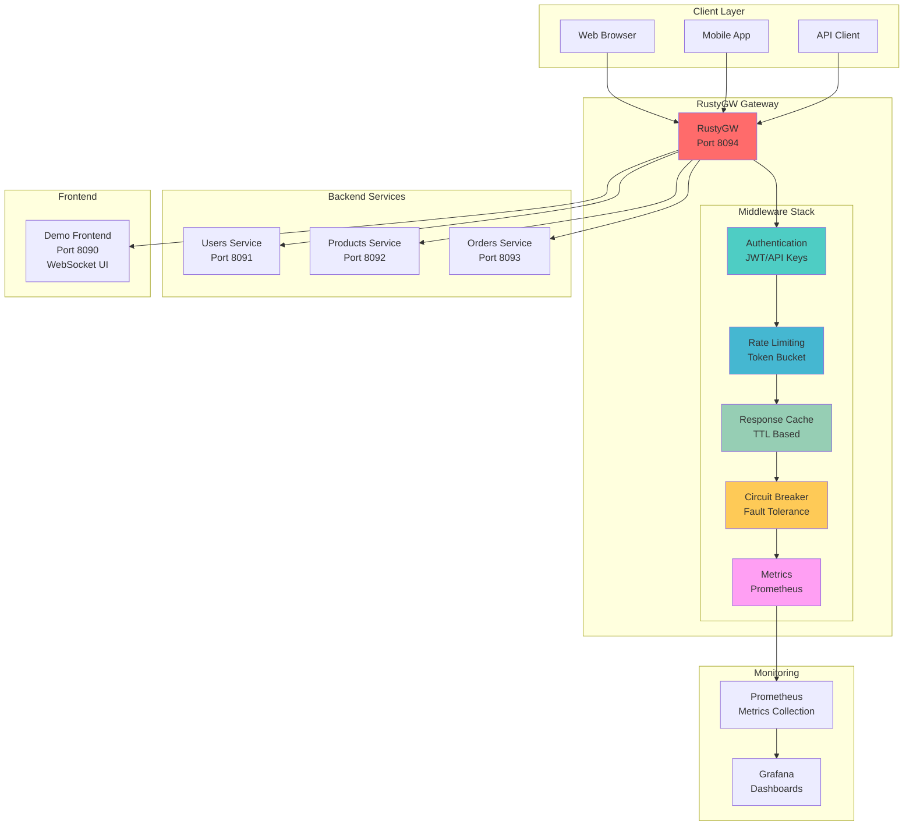
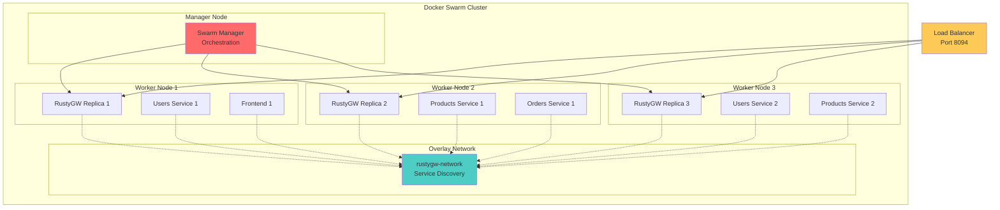

# RustyGW

A high-performance, lightweight API Gateway built in Rust. Perfect for microservices, serverless architectures, and modern cloud-native applications.

> **Note**: This project is a fork and enhancement of [Rust-API-Gateway](https://github.com/Ketankhunti/Rust-API-Gateway) by [@Ketankhunti](https://github.com/Ketankhunti). We've added significant improvements including WebSocket support, enhanced security, Docker Swarm compatibility, and a complete demo application.

[](LICENSE)
[](https://www.rust-lang.org)
[](https://github.com/alfonsodg/RustyGW/releases)

---

## ✨ Features

- **🚀 High Performance**: 10,000+ req/sec with sub-millisecond latency
- **🔒 Security First**: JWT & API key authentication with RBAC
- **⚡ Rate Limiting**: Token bucket algorithm with per-IP protection
- **🔄 Hot Reload**: Zero-downtime configuration updates
- **📊 Observability**: Prometheus metrics and health checks
- **🐳 Cloud Ready**: Docker, Kubernetes, and container-native
- **🌐 WebSocket Support**: Real-time bidirectional communication
- **🛡️ Circuit Breaker**: Fault tolerance and resilience patterns
- **💾 Caching**: Intelligent response caching with TTL
- **📝 Request ID**: Distributed tracing support

---

## 🚀 Quick Start

### Download Binary (Recommended)
```bash
# Download latest release
curl -L https://github.com/alfonsodg/RustyGW/releases/latest/download/rustygw -o rustygw
chmod +x rustygw

# Run with default config
./rustygw
```

### Docker
```bash
# Run with demo
git clone https://github.com/alfonsodg/RustyGW.git
cd RustyGW/demo
docker-compose up
```

### From Source
```bash
git clone https://github.com/alfonsodg/RustyGW.git
cd RustyGW
cargo build --release
./target/release/rustygw
```

---

## ⚙️ Configuration

### Basic Setup
Create `gateway.yaml`:
```yaml
server:
  addr: "127.0.0.1:8094"

routes:
  - name: "api"
    path: "/api/users"
    destination: "http://localhost:3001/users"
    
  - name: "protected"
    path: "/admin"
    destination: "http://localhost:3002/admin"
    auth:
      type: "ApiKey"
      roles: ["admin"]
    rate_limit:
      requests: 100
      period: "1m"
```

### API Keys (`api_keys.yaml`)
```yaml
keys:
  "your-api-key":
    user_id: "admin@example.com"
    roles: ["admin", "user"]
    status: "active"
```

---

## 🏗️ Architecture



### Docker Swarm Architecture



---

## 📊 Performance

| Metric | Value |
|--------|-------|
| **Throughput** | 10,000+ req/sec |
| **Latency** | < 1ms overhead |
| **Memory** | ~10MB footprint |
| **Binary Size** | 8.5MB optimized |
| **Startup Time** | < 100ms |

### Benchmarks
```bash
# Route matching: 65M+ ops/sec
# Rate limiting: 1.6G+ ops/sec  
# Cache operations: High performance
cargo bench
```

---

## 🐳 Docker & Kubernetes

### Docker Compose (Development)
```bash
cd demo
docker-compose up
# Access: http://localhost:8094
```

### Docker Swarm (Production Cluster)

Deploy RustyGW across multiple nodes with high availability:

```bash
# Initialize swarm cluster
docker swarm init

# Deploy the stack
docker stack deploy -c docker-compose.swarm.yml rustygw

# Scale gateway instances
docker service scale rustygw_gateway=5

# Check service status
docker stack services rustygw

# View service logs
docker service logs rustygw_gateway

# Update service (rolling update)
docker service update --image rustygw:v2.0.0 rustygw_gateway

# Remove stack
docker stack rm rustygw
```

#### Swarm Features
- **High Availability**: 3 gateway replicas across nodes
- **Load Balancing**: Built-in service discovery and routing
- **Health Checks**: Automatic container restart on failure
- **Rolling Updates**: Zero-downtime deployments
- **Resource Management**: CPU/memory limits and reservations
- **Overlay Networking**: Secure inter-service communication

#### Production Swarm Setup
```bash
# On manager node
docker swarm init --advertise-addr <MANAGER-IP>

# On worker nodes (use token from init output)
docker swarm join --token <TOKEN> <MANAGER-IP>:2377

# Deploy with production config
docker stack deploy -c docker-compose.swarm.yml rustygw

# Monitor cluster
docker node ls
docker service ls
```

### Kubernetes Deployment
```yaml
apiVersion: apps/v1
kind: Deployment
metadata:
  name: rustygw
spec:
  replicas: 3
  selector:
    matchLabels:
      app: rustygw
  template:
    spec:
      containers:
      - name: rustygw
        image: rustygw:latest
        ports:
        - containerPort: 8094
        livenessProbe:
          httpGet:
            path: /metrics
            port: 8094
```

---

## 📈 Monitoring

### Metrics Endpoint
- **URL**: `http://localhost:8094/metrics`
- **Format**: Prometheus compatible
- **Includes**: Requests, latency, errors, rate limits

### Health Check
- **URL**: `http://localhost:8094/health`
- **Response**: `{"status": "healthy"}`

### Prometheus Config
```yaml
scrape_configs:
  - job_name: 'rustygw'
    static_configs:
      - targets: ['localhost:8094']
```

---

## 🧪 Demo Application

The repository includes a complete demo with:
- **Frontend**: Real-time WebSocket dashboard
- **3 Backend Services**: Users, Products, Orders
- **Gateway**: Unified API access point
- **Docker Compose**: One-command deployment

```bash
cd demo
docker-compose up
# Frontend: http://localhost:8090
# Gateway: http://localhost:8094
```

---

## 🔧 Development

### Prerequisites
- Rust 1.92+ 
- Docker (optional)

### Setup
```bash
git clone https://github.com/alfonsodg/RustyGW.git
cd RustyGW

# Install dependencies and build
cargo build

# Run tests (15+ test suites)
cargo test

# Security audit
cargo audit

# Format and lint
cargo fmt && cargo clippy
```

### Hot Reload Development
```bash
cargo install cargo-watch
cargo watch -x run
```

---

## 🧪 Testing

Comprehensive test coverage with 15+ test suites:

```bash
# All tests
cargo test

# Specific suites
cargo test --test auth_test        # Authentication
cargo test --test rate_limit       # Rate limiting  
cargo test --test concurrency_tests # Thread safety

# With output
cargo test -- --nocapture

# Benchmarks
cargo bench
```

---

## 🚀 Production

### Security Checklist
- ✅ Use strong JWT secrets
- ✅ Enable HTTPS/TLS
- ✅ Configure rate limits
- ✅ Set up monitoring
- ✅ Regular security audits

### Deployment Options
- **Binary**: Single executable, no dependencies
- **Docker**: Container-ready with health checks
- **Docker Swarm**: Multi-node cluster deployment
- **Kubernetes**: Cloud-native with scaling
- **Serverless**: AWS Lambda compatible

### Configuration Management
- Environment variables for secrets
- ConfigMaps for Kubernetes
- Hot reload for zero-downtime updates
- Validation on startup

---

## 🤝 Contributing

1. Fork the repository
2. Create feature branch: `git checkout -b feature/amazing-feature`
3. Run tests: `cargo test`
4. Commit changes: `git commit -m 'Add amazing feature'`
5. Push branch: `git push origin feature/amazing-feature`
6. Open Pull Request

### Code Standards
- Follow Rust conventions
- Add tests for new features
- Update documentation
- Run `cargo fmt` and `cargo clippy`

---

## 🙏 Acknowledgments

This project is built upon the excellent foundation of [Rust-API-Gateway](https://github.com/Ketankhunti/Rust-API-Gateway) by [@Ketankhunti](https://github.com/Ketankhunti). We've extended it with:

- WebSocket support and real-time features
- Enhanced security and authentication
- Docker Swarm compatibility
- Complete demo application with frontend
- Comprehensive testing suite
- Production-ready monitoring and observability
- Performance optimizations and benchmarks

Special thanks to the original author for creating the solid foundation that made this enhanced version possible.

---

## 📄 License

Licensed under the Apache License 2.0 - see [LICENSE](LICENSE) for details.

---

## 🔗 Links

- **Documentation**: [GitHub Wiki](https://github.com/alfonsodg/RustyGW/wiki)
- **Releases**: [GitHub Releases](https://github.com/alfonsodg/RustyGW/releases)
- **Issues**: [GitHub Issues](https://github.com/alfonsodg/RustyGW/issues)
- **Discussions**: [GitHub Discussions](https://github.com/alfonsodg/RustyGW/discussions)

---

<div align="center">

**⭐ Star this project if you find it useful!**

Made with ❤️ and 🦀 Rust

</div>
